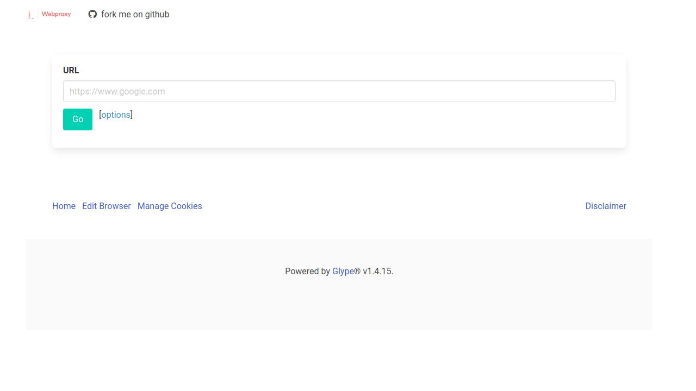

[](https://github.com/cirebon-dev/Webproxy/actions)


Webproxy is [glype](https://github.com/vincentclee/glype) fork version.

## INSTALLATION

require php 8.2 and up.

clone/put all files from this repository into your public path then open `http://your-site/admin.php` or using docker

```
$ git clone https://github.com/cirebon-dev/Webproxy
$ cd Webproxy
$ docker build -t glype .
$ docker run --restart --name glype -p 8080:8080 glype
```
then open `http://your-host:8080/admin.php`

## BUG

there is still many modern website that not work properly with proxy.
